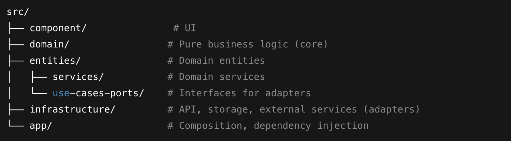

## Decisions and improvements

Improved UI/UX Differences over expected one.

-  Enhanced card spacing and visual separation.

   -  Cards use more padding, clearer whitespace, less clutter.

-  Higher contrast on key metric cards.

   -  Savings card uses bold, colored icon for quick scanning.

-  Sidebar less dominant, more focus on main content.
   -  Cleaner layout, user attention directed to analytics.

## UI/UX Improvements Over Original Design

The implemented UI offers several improvements compared to the PDF design:

### Key Differences & Benefits

| Area         | PDF Design           | Current Implementation (Better)   |
| ------------ | -------------------- | --------------------------------- |
| Card Spacing | Tighter, low padding | More whitespace, less clutter     |
| Metric Cards | Flat, low contrast   | Bold icons, high-contrast numbers |
| Search Bar   | Left, less visible   | Top-right, prominent, accessible  |
| Chart Colors | Busy, inconsistent   | Accessible, consistent blue tones |
| Sidebar      | Wide, dominant       | Minimal, content-focused          |

### UX Benefits

-  **Faster key metric recognition**
   -  Users spot important data quickly with bold icons/colors.
-  **Reduced cognitive load**
   -  Clean spacing and minimal sidebar reduce distractions.
-  **Improved navigation/search**
   -  Search bar is easier to find and use.
-  **Modern, accessible look**
   -  Consistent color palette and whitespace match SaaS best practices.

## Scalability & Future Architecture

### Modular Component Structure

-  Uses atomic design: `atoms`, `molecules`, `organisms` in `/components`.
   -  Encourages reusable, testable UI elements.
   -  Simplifies onboarding and code reviews.

### Feature Isolation

-  Each feature lives in its own folder (e.g., `/insights`).
   -  Scales to large teams, parallel feature development.

### API & State Management Ready

-  `/utils`, `/enums`, `/mock` support data logic separation.
   -  Prepares for scaling with real APIs, global state (Redux, Zustand, etc.).

### TypeScript

-  Ensures type safety across codebase.
   -  Reduces runtime bugs, speeds refactoring.

### Next.js

-  Hybrid SSR/SSG for performance.
   -  Built-in API routes scale backend features.

## Hexagonal Architecture (Frontend)

Adopting hexagonal (ports & adapters) architecture ensures clear separation between business logic and UI logic for long-term maintainability.

### Core Principles

-  **Domain Layer**: Contains all business logic, pure functions, and state transitions.
-  **Ports (Interfaces)**: Define what the domain needs from or exposes to the outside world (UI, APIs, storage).
-  **Adapters**: Implement ports to connect UI, API calls, and infrastructure with the domain.

### Example Folder Structure

### Benefits

-  **Testability**: Business logic tested without UI or API.
-  **Scalability**: Features and integrations added with minimal churn.
-  **Maintainability**: Clearly defined boundaries reduce tech debt.

### Example Use-Case

-  UI calls a use-case via a port (interface).
-  Use-case performs domain logic, returns data to UI.
-  Infrastructure adapters handle API requests, storage, etc.

### Dark/Light Mode Compatibility

-  Theme logic remains in UI adapter layer.
-  Business logic remains theme-agnostic.

---

**Resources**:
[Hexagonal Architecture (Alistair Cockburn)](https://alistair.cockburn.us/hexagonal-architecture/)
